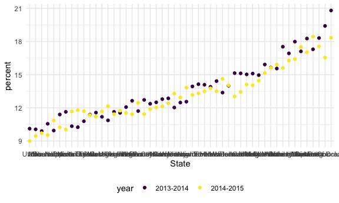

Strings and Factors
================
Philip Kim
10/21/2021

``` r
string_vec = c("my", "name", "is", "jeff")

str_detect(string_vec, "m")
```

    ## [1]  TRUE  TRUE FALSE FALSE

``` r
str_replace(string_vec, "jeff", "Jeff")
```

    ## [1] "my"   "name" "is"   "Jeff"

``` r
string_vec = c(
  "i think we all rule for participating",
  "i think i have been caught",
  "i think this will be quite fun actually",
  "it will be fun, i think"
)

str_detect(string_vec, "^i think") #24:00
```

    ## [1]  TRUE  TRUE  TRUE FALSE

``` r
str_detect(string_vec, "i think$")
```

    ## [1] FALSE FALSE FALSE  TRUE

``` r
string_vec = c(
  "Y'all remember Pres. HW Bush?",
  "I saw a green bush",
  "BBQ and Bushwalking at Molonglo Gorge",
  "BUSH -- LIVE IN CONCERT!!"
  )

str_detect(string_vec, "[Bb]ush") #25:54
```

    ## [1]  TRUE  TRUE  TRUE FALSE

``` r
string_vec = c(
  '7th inning stretch',
  '1st half soon to begin. Texas won the toss.',
  'she is 5 feet 4 inches tall',
  '3AM - cant sleep :('
  )

str_detect(string_vec, "[0-9][a-zaA-Z]")
```

    ## [1]  TRUE  TRUE FALSE  TRUE

``` r
string_vec = c(
  'Its 7:11 in the evening',
  'want to go to 7-11?',
  'my flight is AA711',
  'NetBios: scanning ip 203.167.114.66'
  )

str_detect(string_vec, "7.11")
```

    ## [1]  TRUE  TRUE FALSE  TRUE

## WHy factors are weird

``` r
factor_vec = factor(c("male", "male", "female", "female"))
as.numeric(factor_vec)
```

    ## [1] 2 2 1 1

``` r
factor_vec = fct_relevel(factor_vec, "male")
as.numeric(factor_vec)
```

    ## [1] 1 1 2 2

## NSUDH

``` r
nsudh_url = "http://samhda.s3-us-gov-west-1.amazonaws.com/s3fs-public/field-uploads/2k15StateFiles/NSDUHsaeShortTermCHG2015.htm"

table_marj = 
  read_html(nsudh_url) %>% 
  html_table() %>% 
  first() %>% 
  slice(-1)
```

Let’s clean this up!

``` r
marj_df = 
  table_marj %>% 
  select(-contains("P Value")) %>% 
  pivot_longer(
    -State,
    names_to = "age_year",
    values_to = "percent") %>% 
  separate(age_year, into = c("age", "year"), "\\(") %>% 
  mutate(
    year = str_replace(year, "\\)", ""),
    percent = str_replace(percent, "[a-c]$", ""),
    percent = as.numeric(percent)
  ) %>% 
  filter(!(State %in% c("Total U.S.", "Northeast", "Midwest", "South", "West")))
```

Do dataframe stuff

``` r
marj_df %>% 
  filter(age == "12-17") %>% 
  ggplot(aes(x = State, y = percent, color = year)) +
  geom_point()
```


